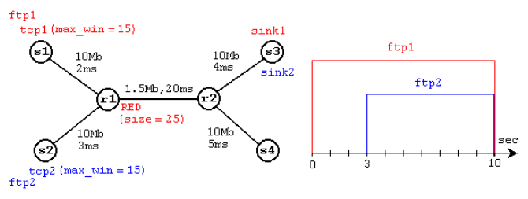
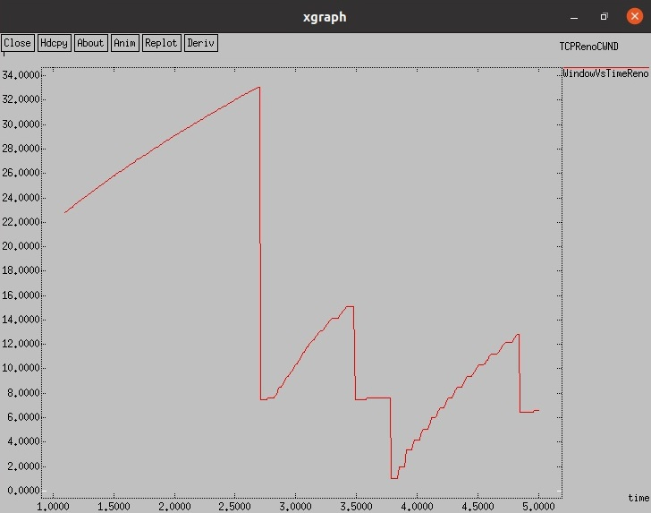
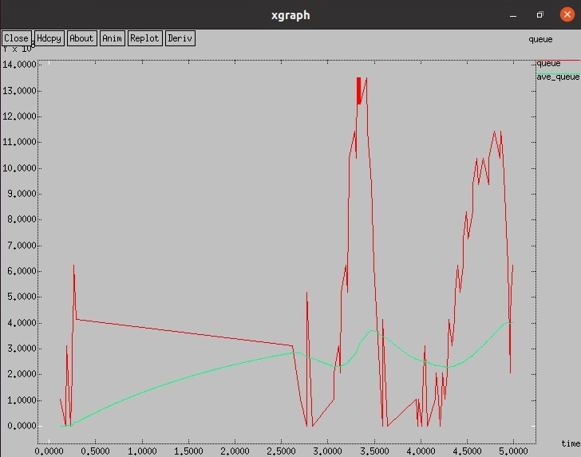
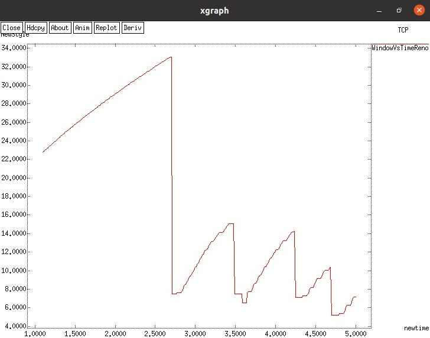
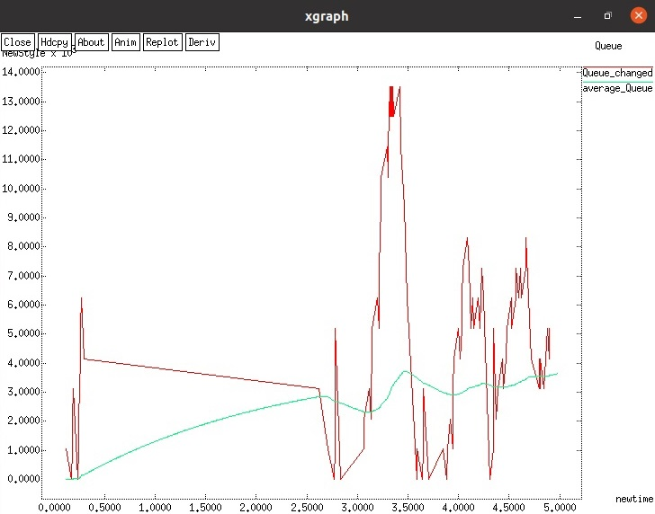
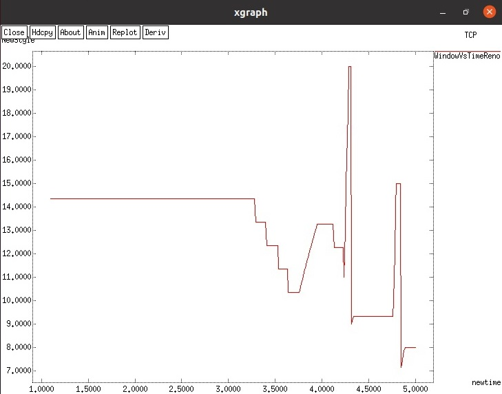
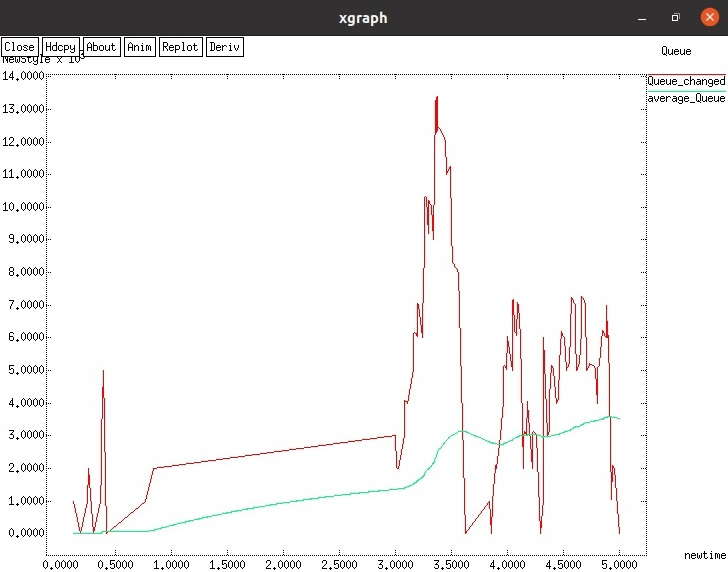

---
## Front matter
lang: ru-RU
title: Лабораторная работа 2. Исследование протокола TCP и алгоритма управления очередью RED.
author:	Баулин Егор Александрович

## Formatting
toc: false
slide_level: 2
theme: metropolis
header-includes: 
 - \metroset{progressbar=frametitle,sectionpage=progressbar,numbering=fraction}
 - '\makeatletter'
 - '\beamer@ignorenonframefalse'
 - '\makeatother'
aspectratio: 43
section-titles: true
---

# Цель работы

Ознакомиться с протоколом TCP и алгоритмом управления очередями RED.

# Задачи

 - Реализовать 	пример алгоритма RED на NS-2 с получением графиков через xgraph.
 - Внести изменения в скрипт заменив TCP Reno на NewReno и Vegas, а также сравнить результаты.

# Моделируемая в примере сеть

{ #fig:2 width=70% }

# Графики для первого случая

{ #fig:2 width=70% }

# Графики для первого случая

{ #fig:3 width=70% }

# При смене Reno на NewReno

{ #fig:4 width=70% }

# При смене Reno на NewReno

{ #fig:5 width=70% }

# При смене Reno на Vegas

{ #fig:6 width=70% }

# При смене Reno на Vegas

{ #fig:7 width=70% }

# Сравнение результатов

Результаты изменений Reno на NewReno практически не дали разницы в показателях. В свою очередь протокол Vegas сокращает частоту колебания размера окна, но амплитуда колебаний выше, чем при NewReno

# Выводы

 - Ознакомился с алгоритмом управления очередями RED, произвел моделирование на NS-2, а также сравнил результаты с разными TCP.