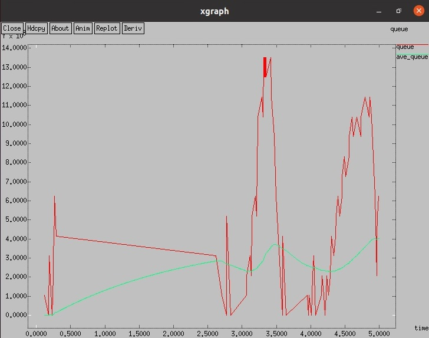
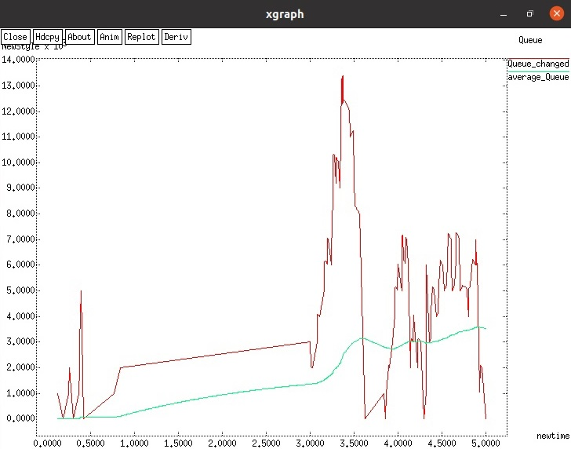

---
# Front matter
lang: ru-RU
title: "Исследование протокола TCP и алгоритма управления очередью RED"
subtitle: "Лабораторная работа №2"
author: "Баулин Егор Александрович, учебная группа: НКНбд-01-18"

# Formatting
toc-title: "Содержание"
toc: true # Table of contents
toc_depth: 2
lof: true # List of figures
fontsize: 12pt
linestretch: 1.5
papersize: a4paper
documentclass: scrreprt
polyglossia-lang: russian
polyglossia-otherlangs: english
mainfont: PT Serif
romanfont: PT Serif
sansfont: PT Sans
monofont: PT Mono
mainfontoptions: Ligatures=TeX
romanfontoptions: Ligatures=TeX
sansfontoptions: Ligatures=TeX,Scale=MatchLowercase
monofontoptions: Scale=MatchLowercase
indent: true
pdf-engine: lualatex
header-includes:
  - \linepenalty=10 # the penalty added to the badness of each line within a paragraph (no associated penalty node) Increasing the value makes tex try to have fewer lines in the paragraph.
  - \interlinepenalty=0 # value of the penalty (node) added after each line of a paragraph.
  - \hyphenpenalty=50 # the penalty for line breaking at an automatically inserted hyphen
  - \exhyphenpenalty=50 # the penalty for line breaking at an explicit hyphen
  - \binoppenalty=700 # the penalty for breaking a line at a binary operator
  - \relpenalty=500 # the penalty for breaking a line at a relation
  - \clubpenalty=150 # extra penalty for breaking after first line of a paragraph
  - \widowpenalty=150 # extra penalty for breaking before last line of a paragraph
  - \displaywidowpenalty=50 # extra penalty for breaking before last line before a display math
  - \brokenpenalty=100 # extra penalty for page breaking after a hyphenated line
  - \predisplaypenalty=10000 # penalty for breaking before a display
  - \postdisplaypenalty=0 # penalty for breaking after a display
  - \floatingpenalty = 20000 # penalty for splitting an insertion (can only be split footnote in standard LaTeX)
  - \raggedbottom # or \flushbottom
  - \usepackage{float} # keep figures where there are in the text
  - \floatplacement{figure}{H} # keep figures where there are in the text
---

# Цель работы

- Ознакомиться с протоколом TCP и алгоритмом управления очередями RED.

# Задание

 - Реализовать 	пример алгоритма RED на NS-2 с получением графиков через xgraph.
 - Внести изменения в скрипт заменив TCP Reno на NewReno и Vegas, а также сравнить результаты. 

# Выполнение лабораторной работы

## Пример с дисциплиной RED

Постановка задачи Описание моделируемой сети:
– сеть состоит из 6 узлов;
– между всеми узлами установлено дуплексное соединение с различными пропускной способностью и задержкой 10 мс;
– узел r1 использует очередь с дисциплиной RED для накопления пакетов, максимальный размер которой составляет 25;
– TCP-источники на узлах s1 и s2 подключаются к TCP-приёмнику на узле s3;
– генераторы трафика FTP прикреплены к TCP-агентам.
На рис. 0.1 приведена схема моделируемой сети.

{ #fig:2 width=70% }

 - При помощи команды touch lab02example.tcl создал новый файл и внес в него следующие изменения:
```
# Узлы сети:
set N 5
for {set i 1} {$i < $N} {incr i} {
	set node_(s$i) [$ns node]
}
set node_(r1) [$ns node]
set node_(r2) [$ns node]

# Соединения:
$ns duplex-link $node_(s1) $node_(r1) 10Mb 2ms DropTail
$ns duplex-link $node_(s2) $node_(r1) 10Mb 3ms DropTail
$ns duplex-link $node_(r1) $node_(r2) 1.5Mb 20ms RED
$ns queue-limit $node_(r1) $node_(r2) 25
$ns queue-limit $node_(r2) $node_(r1) 25
$ns duplex-link $node_(s3) $node_(r2) 10Mb 4ms DropTail
$ns duplex-link $node_(s4) $node_(r2) 10Mb 5ms DropTail

# Агенты и приложения:
set tcp1 [$ns create-connection TCP/Reno $node_(s1) TCPSink $node_(s3) 0]
$tcp1 set window_ 15
set tcp2 [$ns create-connection TCP/Reno $node_(s2) TCPSink $node_(s3) 1]
$tcp2 set window_ 15
set ftp1 [$tcp1 attach-source FTP]
set ftp2 [$tcp2 attach-source FTP]

# Мониторинг размера окна TCP:
set windowVsTime [open WindowVsTimeReno w]
set qmon [$ns monitor-queue $node_(r1) $node_(r2) [open qm.out w] 0.1];
[$ns link $node_(r1) $node_(r2)] queue-sample-timeout;

# Мониторинг очереди:
set redq [[$ns link $node_(r1) $node_(r2)] queue]
set tchan_ [open all.q w]
$redq trace curq_
$redq trace ave_
$redq attach $tchan_

# Добавление at-событий:
$ns at 0.0 "$ftp1 start"
$ns at 1.1 "plotWindow $tcp1 $windowVsTime"
$ns at 3.0 "$ftp2 start"
$ns at 10 "finish"

# Формирование файла с данными о размере окна TCP:
proc plotWindow {tcpSource file} {
	global ns
	set time 0.01
	set now [$ns now]
	set cwnd [$tcpSource set cwnd_]
	puts $file "$now $cwnd"
	$ns at [expr $now+$time] "plotWindow $tcpSource $file"
}

# Процедура finish:
proc finish {} {
global tchan_

# подключение кода AWK:
set awkCode {
{
	if ($1 == "Q" && NF>2) {
		print $2, $3 >> "temp.q";
		set end $2
	}
	else if ($1 == "a" && NF>2)
	print $2, $3 >> "temp.a";
	}
}

set f [open temp.queue w]
puts $f "TitleText: red"
puts $f "Device: Postscript"

if { [info exists tchan_] } {
	close $tchan_
}
exec rm -f temp.q temp.a
exec touch temp.a temp.q

exec awk $awkCode all.q # выполнение кода AWK
puts $f \"queue
exec cat temp.q >@ $f
puts $f \n\"ave_queue
exec cat temp.a >@ $f
close $f

# Запуск xgraph с графиками окна TCP и очереди:
exec xgraph -bb -tk -x time -t "TCPRenoCWND" WindowVsTimeReno &
exec xgraph -bb -tk -x time -y queue temp.queue &
exit 0
}
```
 - Графики, полученные после выполнения команды ns lab02example.tcl:

{ #fig:2 width=70% }

{ #fig:3 width=70% }

## Упражнение

 – Измените в модели на узле s1 тип протокола TCP с Reno на NewReno, затем на Vegas. Сравните и поясните результаты.
 – Внесите изменения при отображении окон с графиками (измените цвет фона, цвет траекторий, подписи к осям, подпись траектории в легенде).

  На узле s1 изменил тип протокола с Reno на NewReno и Vegas. Получившиеся графики:

{ #fig:4 width=70% }

{ #fig:5 width=70% }

{ #fig:6 width=70% }

{ #fig:7 width=70% }

  Результаты изменений Reno на NewReno практически не дали разницы в показателях. В свою очередь протокол Vegas сокращает частоту колебания размера окна, но амплитуда колебаний выше, чем при NewReno

# Выводы

 - Ознакомился с алгоритмом управления очередями RED, произвел моделирование на NS-2, а также сравнил результаты с разными TCP.

