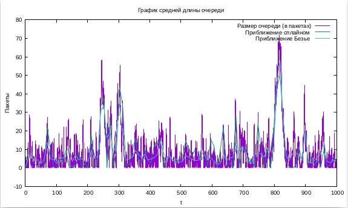

---
# Front matter
lang: ru-RU
title: "Моделирование стохастических процессов"
subtitle: "Лабораторная работа №3"
author: "Баулин Егор Александрович, учебная группа: НКНбд-01-18"

# Formatting
toc-title: "Содержание"
toc: true # Table of contents
toc_depth: 2
lof: true # List of figures
fontsize: 12pt
linestretch: 1.5
papersize: a4paper
documentclass: scrreprt
polyglossia-lang: russian
polyglossia-otherlangs: english
mainfont: PT Serif
romanfont: PT Serif
sansfont: PT Sans
monofont: PT Mono
mainfontoptions: Ligatures=TeX
romanfontoptions: Ligatures=TeX
sansfontoptions: Ligatures=TeX,Scale=MatchLowercase
monofontoptions: Scale=MatchLowercase
indent: true
pdf-engine: lualatex
header-includes:
  - \linepenalty=10 # the penalty added to the badness of each line within a paragraph (no associated penalty node) Increasing the value makes tex try to have fewer lines in the paragraph.
  - \interlinepenalty=0 # value of the penalty (node) added after each line of a paragraph.
  - \hyphenpenalty=50 # the penalty for line breaking at an automatically inserted hyphen
  - \exhyphenpenalty=50 # the penalty for line breaking at an explicit hyphen
  - \binoppenalty=700 # the penalty for breaking a line at a binary operator
  - \relpenalty=500 # the penalty for breaking a line at a relation
  - \clubpenalty=150 # extra penalty for breaking after first line of a paragraph
  - \widowpenalty=150 # extra penalty for breaking before last line of a paragraph
  - \displaywidowpenalty=50 # extra penalty for breaking before last line before a display math
  - \brokenpenalty=100 # extra penalty for page breaking after a hyphenated line
  - \predisplaypenalty=10000 # penalty for breaking before a display
  - \postdisplaypenalty=0 # penalty for breaking after a display
  - \floatingpenalty = 20000 # penalty for splitting an insertion (can only be split footnote in standard LaTeX)
  - \raggedbottom # or \flushbottom
  - \usepackage{float} # keep figures where there are in the text
  - \floatplacement{figure}{H} # keep figures where there are in the text
---

# Цель работы

- Ознакомиться c моделированием стохастических процессов с использованием NS-2, а также получить график. 

# Задание

 - Реализовать модель на NS-2
 - Получить результаты моделирования в виде графика, используя GNUplot

# Выполнение лабораторной работы

## Реализация модели на NS-2
 - При помощи команды touch lab03.tcl создал файл и отредактировал его добавив следующий код: 

```
# создание объекта Simulator
set ns [new Simulator]

# открытие на запись файла out.tr для регистрации событий
set tf [open out.tr w]
$ns trace-all $tf

# задаём значения параметров системы
set lambda 30.0
set mu 33.0

# размер очереди для M|M|1 (для M|M|1|R: set qsize R)
set qsize 100000

# устанавливаем длительность эксперимента
set duration 1000.0

# задаём узлы и соединяем их симплексным соединением
# с полосой пропускания 100 Кб/с и задержкой 0 мс,
# очередью с обслуживанием типа DropTail
set n1 [$ns node]
set n2 [$ns no
set link [$ns simplex-link $n1 $n2 100kb 0ms DropTail]

# наложение ограничения на размер очереди:
$ns queue-limit $n1 $n2 $qsize

# задаём распределения интервалов времени
# поступления пакетов и размера пакетов
set InterArrivalTime [new RandomVariable/Exponential]
$InterArrivalTime set avg_ [expr 1/$lambda]
set pktSize [new RandomVariable/Exponential]
$pktSize set avg_ [expr 100000.0/(8*$mu)]

# задаём агент UDP и присоединяем его к источнику,
# задаём размер пакета
set src [new Agent/UDP]
$src set packetSize_ 100000
$ns attach-agent $n1 $src

# задаём агент-приёмник и присоединяем его
set sink [new Agent/Null]
$ns attach-agent $n2 $sink
$ns connect $src $sink

# мониторинг очереди
set qmon [$ns monitor-queue $n1 $n2 [open qm.out w] 0.1]
$link queue-sample-timeout

# процедура finish закрывает файлы трассировки
proc finish {} {
	global ns tf
	$ns flush-trace
	close $tf
	exit 0
}

# процедура случайного генерирования пакетов
proc sendpacket {} {
	global ns src InterArrivalTime pktSize
	set time [$ns now]
	$ns at [expr $time +[$InterArrivalTime value]] "sendpacket"
	set bytes [expr round ([$pktSize value])]
	$src send $bytes
}

# планировщик событий
$ns at 0.0001 "sendpacket"
$ns at $duration "finish"

# расчет загрузки системы и вероятности потери пакетов
set rho [expr $lambda/$mu]
set ploss [expr (1-$rho)*pow($rho,$qsize)/(1-pow($rho,($qsize+1)))]
puts "Теоретическая вероятность потери = $ploss"
set aveq [expr $rho*$rho/(1-$rho)]
puts "Теоретическая средняя длина очереди = $aveq"

# запуск модели
$ns run
```

 После выполнения скрипта мы получаем файл qm.out, который будет использоваться для построения графиков.

## График в GNUplot

 - При помощи команды touch создал файл graph_plot. Отредактировал файл добавив в него следующий код:\
```
#!/usr/bin/gnuplot -persist

# задаём текстовую кодировку,
# тип терминала, тип и размер шрифта
set encoding utf8
set term pdfcairo font "Arial,9"

# задаём выходной файл графика
set out 'qm.pdf'

# задаём название графика
set title "График средней длины очереди"

# задаём стиль линии
set style line 2

# подписи осей графика
set xlabel "t"
set ylabel "Пакеты"

# построение графика, используя значения
# 1-го и 5-го столбцов файла qm.out
plot "qm.out" using ($1):($5) with lines title "Размер очереди (в пакетах)",\
"qm.out" using ($1):($5) smooth csplines title " Приближение сплайном ", \
"qm.out" using ($1):($5) smooth bezier title " Приближение Безье "
```
 Далее при помощи команды chmod u+x graph_plot сделал файл исполняемым и запустил командой ./graph_plot. 

- Получаем следующий файл out.pdf

{ #fig:2 width=70% }

# Выводы

 - Произвел моделирование процесса при помощи NS-2, а также получил график средней длины очереди с использованием GNUplot.

