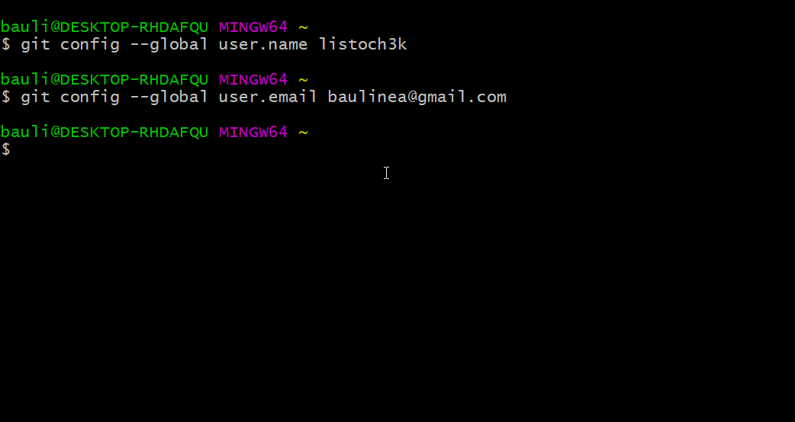
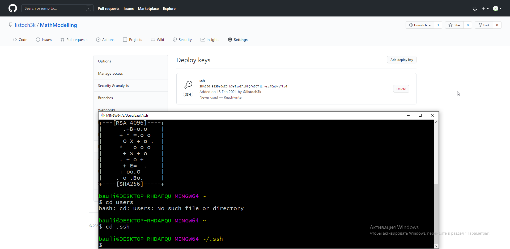

---
# Front matter
lang: ru-RU
title: "Лабораторная работа #1"
subtitle: "Git, Markdown"
author: "Баулин Егор Александрович, учебная группа: НКНбд-01-18"

# Formatting
toc-title: "Содержание"
toc: true # Table of contents
toc_depth: 2
lof: true # List of figures
lot: true # List of tables
fontsize: 12pt
linestretch: 1.5
papersize: a4paper
documentclass: scrreprt
polyglossia-lang: russian
polyglossia-otherlangs: english
mainfont: PT Serif
romanfont: PT Serif
sansfont: PT Sans
monofont: PT Mono
mainfontoptions: Ligatures=TeX
romanfontoptions: Ligatures=TeX
sansfontoptions: Ligatures=TeX,Scale=MatchLowercase
monofontoptions: Scale=MatchLowercase
indent: true
pdf-engine: lualatex
header-includes:
  - \linepenalty=10 # the penalty added to the badness of each line within a paragraph (no associated penalty node) Increasing the value makes tex try to have fewer lines in the paragraph.
  - \interlinepenalty=0 # value of the penalty (node) added after each line of a paragraph.
  - \hyphenpenalty=50 # the penalty for line breaking at an automatically inserted hyphen
  - \exhyphenpenalty=50 # the penalty for line breaking at an explicit hyphen
  - \binoppenalty=700 # the penalty for breaking a line at a binary operator
  - \relpenalty=500 # the penalty for breaking a line at a relation
  - \clubpenalty=150 # extra penalty for breaking after first line of a paragraph
  - \widowpenalty=150 # extra penalty for breaking before last line of a paragraph
  - \displaywidowpenalty=50 # extra penalty for breaking before last line before a display math
  - \brokenpenalty=100 # extra penalty for page breaking after a hyphenated line
  - \predisplaypenalty=10000 # penalty for breaking before a display
  - \postdisplaypenalty=0 # penalty for breaking after a display
  - \floatingpenalty = 20000 # penalty for splitting an insertion (can only be split footnote in standard LaTeX)
  - \raggedbottom # or \flushbottom
  - \usepackage{float} # keep figures where there are in the text
  - \floatplacement{figure}{H} # keep figures where there are in the text
---

# Цель работы

Целью лабораторной работы #1 является знакомство с системой контроля версий Git и языком разметки Markdown.

# Задание

В ходе выполнения лабораторной работы были выполнены следующие задания:
1. Начальная конфигурация системы Git.
2. Создание нового репозитория.
3. Создание и загрузка файлов на Github.
4. Подключение SSH ключа к репозиторию.
5. Выпуск тестового релиза.
6. Оформление отчёта и презентации по лабораторной работе с использованием Markdown.

# Выполнение лабораторной работы

*1.* Выполняем начальную конфигурацию системы. (рис. 1)

{ #fig:001 width=70% }

*2.* Создаём репозиторий на Github. (рис. 2)

{ #fig:002 width=70% }

*3.* Загружаем файл hello.html (рис. 3)

{ #fig:003 width=70% }

*4.* Генерируем и подключаем SSH ключ к репозиторию. (рис. 4)

{ #fig:004 width=70% }

*5.* Выполняем релиз. (рис. 5)

{ #fig:005 width=70% }

# Выводы

Во время выполнения лабораторной работы я успешно ознакомился с функциями системы контроля версий Git, а также языком разметки Markdown.
