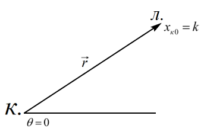
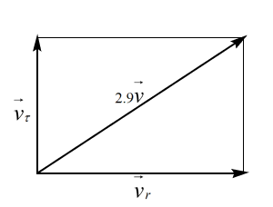
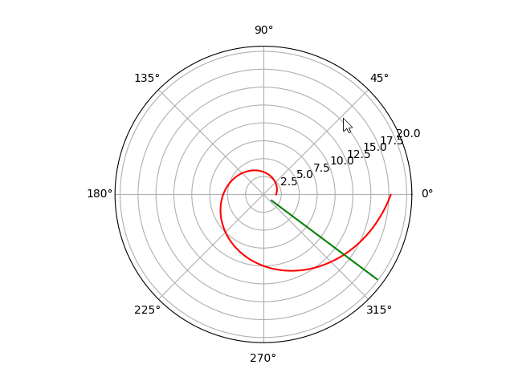
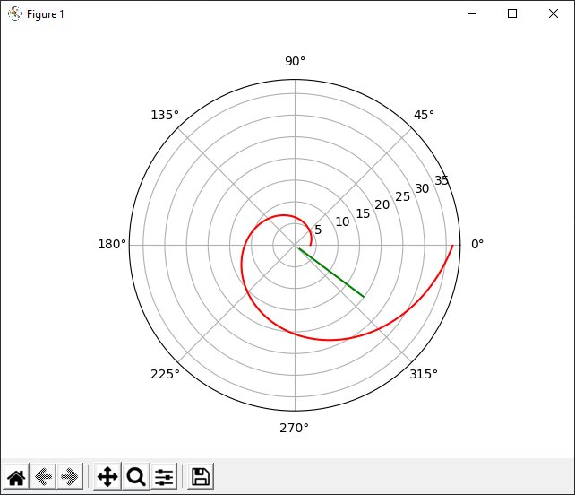

---
# Front matter
lang: ru-RU
title: "Лабораторная работа #2"
subtitle: "Задача о погоне. Вариант 11"
author: "Баулин Егор Александрович, учебная группа: НКНбд-01-18"

# Formatting
toc-title: "Содержание"
toc: true # Table of contents
toc_depth: 2
lof: true # List of figures
fontsize: 12pt
linestretch: 1.5
papersize: a4paper
documentclass: scrreprt
polyglossia-lang: russian
polyglossia-otherlangs: english
mainfont: PT Serif
romanfont: PT Serif
sansfont: PT Sans
monofont: PT Mono
mainfontoptions: Ligatures=TeX
romanfontoptions: Ligatures=TeX
sansfontoptions: Ligatures=TeX,Scale=MatchLowercase
monofontoptions: Scale=MatchLowercase
indent: true
pdf-engine: lualatex
header-includes:
  - \linepenalty=10 # the penalty added to the badness of each line within a paragraph (no associated penalty node) Increasing the value makes tex try to have fewer lines in the paragraph.
  - \interlinepenalty=0 # value of the penalty (node) added after each line of a paragraph.
  - \hyphenpenalty=50 # the penalty for line breaking at an automatically inserted hyphen
  - \exhyphenpenalty=50 # the penalty for line breaking at an explicit hyphen
  - \binoppenalty=700 # the penalty for breaking a line at a binary operator
  - \relpenalty=500 # the penalty for breaking a line at a relation
  - \clubpenalty=150 # extra penalty for breaking after first line of a paragraph
  - \widowpenalty=150 # extra penalty for breaking before last line of a paragraph
  - \displaywidowpenalty=50 # extra penalty for breaking before last line before a display math
  - \brokenpenalty=100 # extra penalty for page breaking after a hyphenated line
  - \predisplaypenalty=10000 # penalty for breaking before a display
  - \postdisplaypenalty=0 # penalty for breaking after a display
  - \floatingpenalty = 20000 # penalty for splitting an insertion (can only be split footnote in standard LaTeX)
  - \raggedbottom # or \flushbottom
  - \usepackage{float} # keep figures where there are in the text
  - \floatplacement{figure}{H} # keep figures where there are in the text
---

# Цель работы

Научиться решать задачу о погоне, строить графики траектории движения, выводить уравнение, описывающее движение.

# Задание

На море в тумане катер береговой охраны преследует лодку браконьеров. Через определенный промежуток времени туман рассеивается, и лодка обнаруживается на расстоянии 6.9 км от катера. Затем лодка снова скрывается в тумане и уходит прямолинейно в неизвестном направлении. Известно, что скорость катера в 3,9 раза больше скорости браконьерской лодки.

  1. Запишите уравнение, описывающее движение катера, с начальными условиями для двух случаев (в зависимости от расположения катера относительно лодки в начальный момент времени).
  2. Постройте траекторию движения катера и лодки для двух случаев.
  3. Найдите точку пересечения траектории катера и лодки 

# Выполнение лабораторной работы

## Постановка задачи
1. Место нахождения лодки браконьеров в момент обнаружения: $t_0 = 0, x_{л0} = 0$
. Место нахождения катера береговой охраны относительно лодки браконьеров в момент обнаружения лодки: $x_{к0} = 0$


2. Введем полярные координаты. Считаем, что полюс - это точка обнаружения лодки браконьеров $x_{л0} (0 = x_{л0} = 0)$
, а полярная ось r проходит через точку нахождения катера береговой охраны (рис. -@fig:001)

{ #fig:001 width=70% }

3. Траектория катера должна быть такой, чтобы и катер, и лодка все время были на одном расстоянии от полюса, только в этом случае траектория катера пересечется с траекторией лодки. Поэтому для начала катер береговой охраны должен двигаться некоторое время прямолинейно, пока не окажется на том же расстоянии от полюса, что и лодка браконьеров. После этого катер береговой охраны должен двигаться вокруг полюса удаляясь от него с той же скоростью, что и лодка браконьеров.


4. Чтобы найти расстояние $X$ (расстояние, после которого катер начнет двигаться вокруг полюса), необходимо составить простое уравнение. Пусть через время t катер и лодка окажутся на одном расстоянии $x$ от полюса. За это время лодка пройдет $x$, а катер — $k - x$ (или $k + x$ в зависимости от начального положения катера относительно полюса). Время, за которое они пройдут это расстояние, вычисляется как $x/v$ или ${k-x}/2.9v$ (во втором случае ${k+x}/2.9v$). Так как время одно и то же, то эти величины одинаковы. Тогда неизвестное расстояние $x$ можно найти из следующего уравнения:
$$ \frac{x}{v} = \frac{k-x}{2.9v}\ в\ первом \ случае$$
или
$$ \frac{x}{v} = \frac{k+x}{2.9v}\ во\ втором.$$

Отсюда мы найдем два значения $x_1 = \frac{k}{3.9}$ и $x_2 = \frac{k}{1.9}$
, задачу будем решать для двух случаев.


5. После того, как катер береговой охраны окажется на одном расстоянии от полюса, что и лодка, он должен сменить прямолинейную траекторию и начать двигаться вокруг полюса, удаляясь от него со скоростью лодки $v$. Для этого скорость катера раскладываем на две составляющие: $v_r$ — радиальная скорость и $v_{\tau}$ — тангенциальная скорость (рис. 2). Радиальная скорость - это скорость, с которой катер удаляется от полюса, $v_r = \frac{dr}{dt}$. Нам нужно, чтобы эта скорость была равна скорости лодки, поэтому полагаем $\frac{dr}{dt}=v$.

Тангенциальная скорость – это линейная скорость вращения катера относительно полюса. Она равна произведению угловой скорости $\frac{\partial \theta}{\partial t}$ на радиус $r,\ v_{\tau} = r \frac{\partial \theta}{\partial t}$

Из рисунка (рис. -@fig:002) видно: $v_{\tau} = \sqrt{8.41v^2 - v^2} = \sqrt{7.41}v$ (учитывая, что радиальная скорость равна $v$). Тогда получаем $r \frac{\partial \theta}{\partial t} = \sqrt{7.41}v$

{ #fig:002 width=70% }

6. Решение исходной задачи сводится к решению системы из двух дифференциальных уравнений: 

\begin{equation*} 
  \begin{cases} 
    \frac{\partial r}{\partial t} = v 
    \\
    r \frac{\partial \theta}{\partial t} = \sqrt{7.41} v 
  \end{cases}
\end{equation*} 

с начальными условиями 

\begin{equation*}
  \begin{cases}
    \theta_0 = 0 
    \\ 
    r_0 = x_1 
  \end{cases}
\end{equation*}

\begin{equation*}
  \begin{cases}
    \theta_0 = -\pi
    \\
    r_0 = x_2
  \end{cases}
\end{equation*} 

Исключая из полученной системы производную по $t$, можно перейти к следующему уравнению:
$$ \frac{\partial r}{\partial \theta} = \frac{r}{\sqrt{7.41}}.$$
Начальные условия остаются прежними. Решив это уравнение, мы получим траекторию движения катера в полярных координатах.

## Код для решения задачи на языке Python.

```
k = 6.9
v = 2.9
fi = 3 * math.pi / 4


# Движение береговой охраны
def dr(r, theta ):
  res = r / math.sqrt((v ** 2) - 1)
  return res


# Движение браконьерской лодки
def f2(t):
  xt = math.tan(fi) * t
  return xt

# Два случая
for vx in [1.9, 3.9]:
  r0 = k / vx  # Наши два случая

  tetha = np.arange(0, 2 * math.pi, 0.01)

  r = odeint(dr, r0, tetha)  # Решение дифф. уравнения
  t = np.arange(0, 15, 1)

  # Переведем всё в полярные координаты
  pol = t * t + f2(t) * f2(t)
  r2 = np.sqrt(pol)

  tetha2 = (np.tan(f2(t) / t)) ** (-1)

  polar(tetha, r, "r")
  polar(tetha2, r2, "g")
  plt.show()
```
 Полученные графики.
{ #fig:003 width=70% }
{ #fig:004 width=70% }

# Выводы

  1. Научился формулировать задачу и переводить ее на математический язык.
  2. Решил задачу о погоне при помощи различных инструментов.


