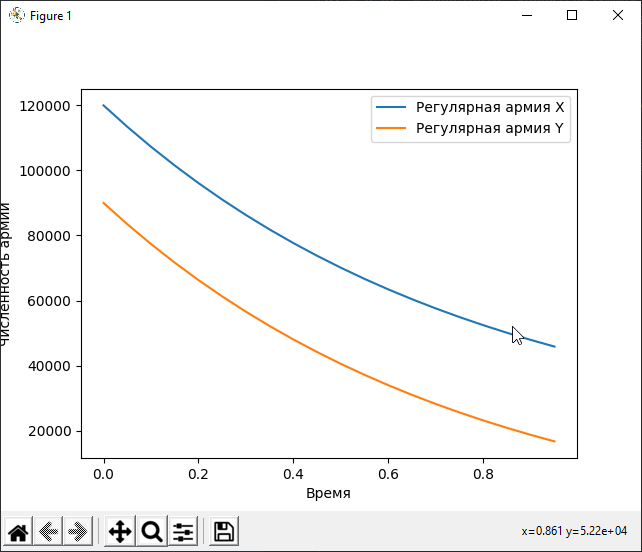
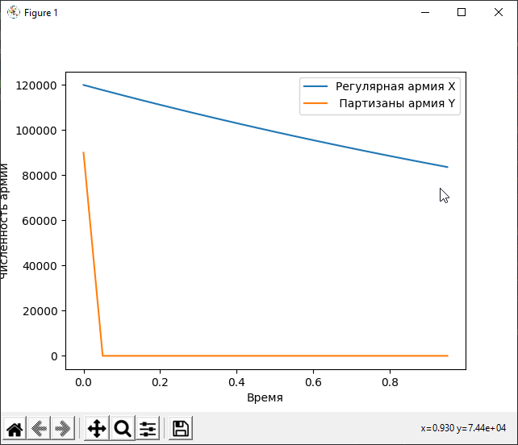

---
## Front matter
lang: ru-RU
title: Лабораторная работа 3. Модель боевых действий.
author:	Баулин Егор Александрович

## Formatting
toc: false
slide_level: 2
theme: metropolis
header-includes: 
 - \metroset{progressbar=frametitle,sectionpage=progressbar,numbering=fraction}
 - '\makeatletter'
 - '\beamer@ignorenonframefalse'
 - '\makeatother'
aspectratio: 43
section-titles: true
---

# Цель работы

- Рассмотреть простейшую модель боевых действий – модель Ланчестера:

# Задачи
1. Просчитать возможности подходов подкреплений к армиям;
2. Составить системы дифференциальных уравнений изменения численностей армий;
3. Построить графики для моделей боевых действий. 

# Результаты выполнения лабораторной работы

Первый случай
{ #fig:001 width=70% }

Второй случай
{ #fig:002 width=70% }

##

Спасибо за внимание!

