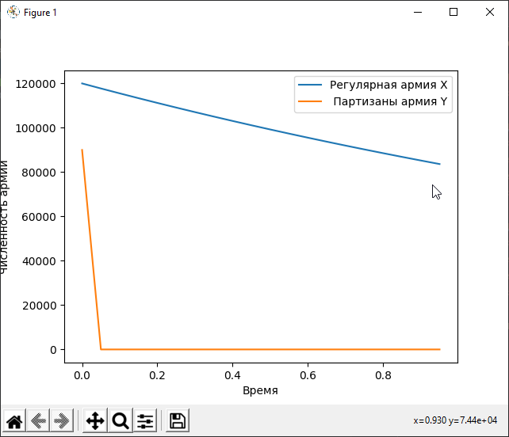

---
# Front matter
lang: ru-RU
title: "Лабораторная работа #3"
subtitle: "Модель боевых действий. Вариант 11"
author: "Баулин Егор Александрович, учебная группа: НКНбд-01-18"

# Formatting
toc-title: "Содержание"
toc: true # Table of contents
toc_depth: 2
lof: true # List of figures
lot: true # List of tables
fontsize: 12pt
linestretch: 1.5
papersize: a4paper
documentclass: scrreprt
polyglossia-lang: russian
polyglossia-otherlangs: english
mainfont: PT Serif
romanfont: PT Serif
sansfont: PT Sans
monofont: PT Mono
mainfontoptions: Ligatures=TeX
romanfontoptions: Ligatures=TeX
sansfontoptions: Ligatures=TeX,Scale=MatchLowercase
monofontoptions: Scale=MatchLowercase
indent: true
pdf-engine: lualatex
header-includes:
  - \linepenalty=10 # the penalty added to the badness of each line within a paragraph (no associated penalty node) Increasing the value makes tex try to have fewer lines in the paragraph.
  - \interlinepenalty=0 # value of the penalty (node) added after each line of a paragraph.
  - \hyphenpenalty=50 # the penalty for line breaking at an automatically inserted hyphen
  - \exhyphenpenalty=50 # the penalty for line breaking at an explicit hyphen
  - \binoppenalty=700 # the penalty for breaking a line at a binary operator
  - \relpenalty=500 # the penalty for breaking a line at a relation
  - \clubpenalty=150 # extra penalty for breaking after first line of a paragraph
  - \widowpenalty=150 # extra penalty for breaking before last line of a paragraph
  - \displaywidowpenalty=50 # extra penalty for breaking before last line before a display math
  - \brokenpenalty=100 # extra penalty for page breaking after a hyphenated line
  - \predisplaypenalty=10000 # penalty for breaking before a display
  - \postdisplaypenalty=0 # penalty for breaking after a display
  - \floatingpenalty = 20000 # penalty for splitting an insertion (can only be split footnote in standard LaTeX)
  - \raggedbottom # or \flushbottom
  - \usepackage{float} # keep figures where there are in the text
  - \floatplacement{figure}{H} # keep figures where there are in the text
---

# Цель работы

- Рассмотреть простейшую модель боевых действий – модель Ланчестера:
	- Просчитывать возможности подходов подкреплений к армиям;
	- Составлять системы дифференциальных уравнений изменения численностей армий;
	- Строить графики для моделей боевых действий. 

# Задание

Между страной Х и страной У идет война. Численность состава войск исчисляется от начала войны, и являются временными функциями
$x(t)$ и $y(t)$. В начальный момент времени страна Х имеет армию численностью 120 000 человек, а в распоряжении страны У армия численностью в 90 000 человек. Для упрощения модели считаем, что коэффициенты $a,b,c,h$ постоянны. Также считаем $P(t)$ и $Q(t)$ непрерывные функции.

Постройте графики изменения численности войск армии Х и армии У для следующих случаев:


Между регулярными войсками:

$$ \frac{\partial x}{\partial t} = -0.62x(t) - 0.68y(t) + sin(2t)$$
$$ \frac{\partial y}{\partial t} = -0.59x(t) - 0.71y(t) + cos(2t)$$

Между регулярными и партизанами:

$$ \frac{\partial x}{\partial t} = -0.38x(t) - 0.68y(t) + sin(2t)$$
$$ \frac{\partial y}{\partial t} = -0.21x(t)y(t) - 0.71y(t) + cos(2t)$$

# Выполнение лабораторной работы

Код на Python:

```
import numpy as np
from scipy.integrate import odeint
import matplotlib.pyplot as plt

x0 = 120000  # Численность первой армии
y0 = 90000  # Численность второй армии

# Модель боевых действий между регулярными войсками
a1 = 0.62  # Константа, характеризующая степень влияния различных факторов на потери
b1 = 0.68  # Эффективность боевых действий армии Y
c1 = 0.59  # Эффективность боевых действий армии X
h1 = 0.71  # Константа, характеризующая степень влияния различных факторов на потери

# Модель боевых действий между регулярными войсками и партизанами
a2 = 0.38  # Константа, характеризующая степень влияния различных факторов на потери
b2 = 0.68  # Эффективность боевых действий армии Y
c2 = 0.21  # Эффективность боевых действий армии X
h2 = 0.71  # Константа, характеризующая степень влияния различных факторов на потери

# Показатель времени
t0 = 0
t_max = 1
dt = 0.05
t = np.arange(t0, t_max, dt)

# Первый случай
def P1(t):
    p1 = np.sin(2*t)
    return p1


def Q1(t):
    q1 = np.cos(2*t)
    return q1

# Второй случай
def P2(t):
    p2 = np.sin(2*t)
    return p2


def Q2(t):
    q2 = np.cos(2*t)
    return q2


# Изменения численности
# Первый случай
def S1(f, t):
    s11 = -a1 * f[0] - b1 * f[1] + P1(t)
    s12 = -c1 * f[0] - h1 * f[1] + Q1(t)
    return s11, s12


# Второй случай
def S2(f, t):
    s21 = -a2 * f[0] - b2 * f[1] + P2(t)
    s22 = -c2 * f[0] * f[1] - h2 * f[1] + Q2(t)
    return s21, s22


v = np.array([x0, y0])  # Вектор начальных условий

# Решение
f1 = odeint(S1, v, t)
f2 = odeint(S2, v, t)

# Построение графиков решений
# Две регулярные армии
plt.plot(t, f1)
plt.ylabel('Численность армии')
plt.xlabel('Время')
plt.legend(['Регулярная армия X', 'Регулярная армия Y'])
plt.show()

# Регулярная армия и партизаны
plt.plot(t, f2)
plt.ylabel('Численность армии')
plt.xlabel('Время')
plt.legend(['Регулярная армия X', ' Партизаны армия Y'])
plt.show()
```

График первого случая (рис. 1)

{ #fig:001 width=70% }

График второго случай (рис. 2)

{ #fig:002 width=70% }

# Выводы

 - Рассмотрел простейшую модель боевых действий – модель Ланчестера:
	- Научился просчитывать возможности подходов подкреплений к армиям;
	- Научился оставлять системы дифференциальных уравнений изменения численностей армий;
	- Научился строить графики для моделей боевых действий. 


