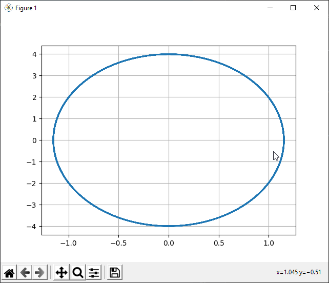
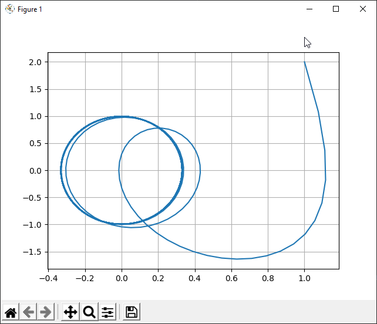
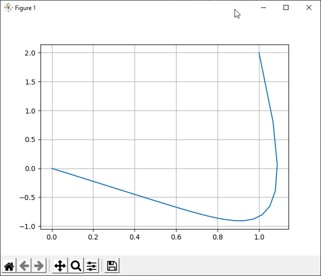

---
## Front matter
lang: ru-RU
title: Лабораторная работа 4. Модель гармонических колебаний.
author:	Баулин Егор Александрович

## Formatting
toc: false
slide_level: 2
theme: metropolis
header-includes: 
 - \metroset{progressbar=frametitle,sectionpage=progressbar,numbering=fraction}
 - '\makeatletter'
 - '\beamer@ignorenonframefalse'
 - '\makeatother'
aspectratio: 43
section-titles: true
---

# Цель работы

Рассмотреть модель гармонических колебаний

# Задачи
 
Построить фазовый портрет гармонического осциллятора и решить уравнения гармонического осциллятора для следующих случаев
	- Колебания гармонического осциллятора без затуханий и без действий внешней силы $\ddot {x} + 12x = 0$
	- Колебания гармонического осциллятора c затуханием и без действий внешней силы $\ddot {x} + 10 \dot {x} + 5x = 0$
	- Колебания гармонического осциллятора c затуханием и под действием внешней силы $\ddot {x} + 7 \dot {x} + 7x = 0.7sin(3t)$

На интервале $t \in [0; 60]$(шаг 0.05) с начальными условиями $x_0 = 1, y_0 = 2$

# Результаты выполнения лабораторной работы

## Фазовый портрет без затухания и воздействия внешней силы (рис. 1)

{ #fig:001 width=70% }

## Фазовый портрет с затуханием без воздействия внешней силы (рис. 2)

{ #fig:002 width=70% }

## Фазовый портрет с затуханием и под воздействием внешней силы (рис. 3)

{ #fig:003 width=70% }}

# Выводы

 - Построил фазовый портрет гармонического осциллятора и решил уравнения гармонического осциллятора:
	- Колебания гармонического осциллятора без затуханий и без действий внешней силы.
	- Колебания гармонического осциллятора c затуханием и без действий внешней силы.
	- Колебания гармонического осциллятора c затуханием и под действием внешней силы.

