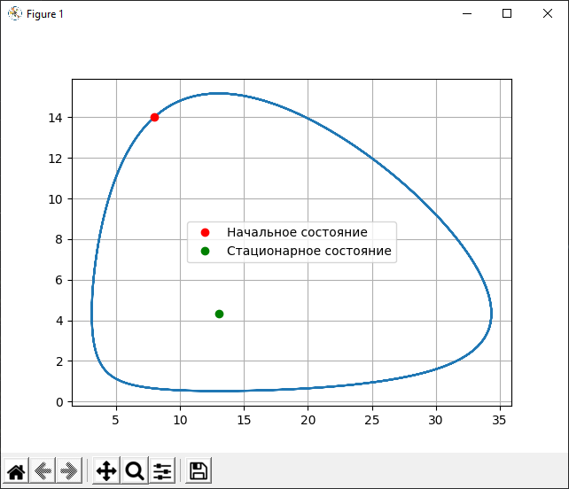
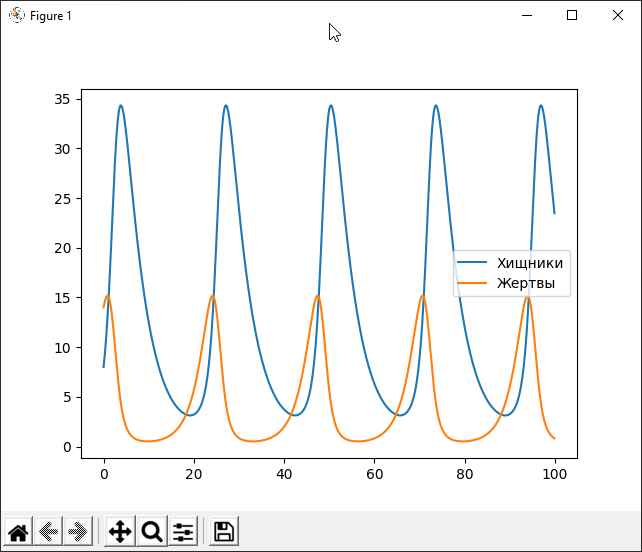

---
## Front matter
lang: ru-RU
title: Лабораторная работа 5. Модель хищник-жертва.
author:	Баулин Егор Александрович

## Formatting
toc: false
slide_level: 2
theme: metropolis
header-includes: 
 - \metroset{progressbar=frametitle,sectionpage=progressbar,numbering=fraction}
 - '\makeatletter'
 - '\beamer@ignorenonframefalse'
 - '\makeatother'
aspectratio: 43
section-titles: true
---

# Цель работы

Рассмотреть простейшую модель "хищник-жертва" — модель Лотки-Вольтерры.

# Задачи
 
	- Построить график зависимости численности хищников от численности жертв и графики изменения численности хищников и численности жертв при следующих начальных условиях: $x_{0}=8, y_{0}=14$.

	- Найти стационарное состояние системы

## Модель Лотки-Вольтерры

$$
\begin{cases}
    \frac{\partial x}{\partial t} = -0.23x(t)+0.053x(t)y(t)
    \\
    \frac{\partial y}{\partial t} = 0.43y(t)-0.033x(t)y(t)
\end{cases}
$$

0.23 — коэффициент естественной смертности хищников

0.053 — коэффициент увеличения числа хищников

0.43 — коэффициент естественного прироста жертв

0.033 — коэффициент смертности жертв

# Результаты выполнения лабораторной работы

## Графики

{ #fig:001 width=70% }

## Графики 

{ #fig:002 width=70% }

# Выводы

 - Рассмотрел простейшую модель "хищник-жертва" — модель Лотки-Вольтерры. 

