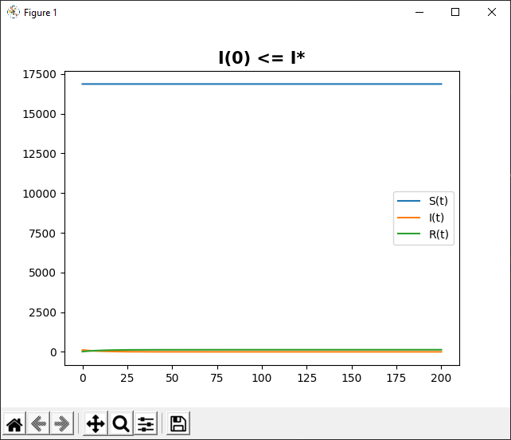
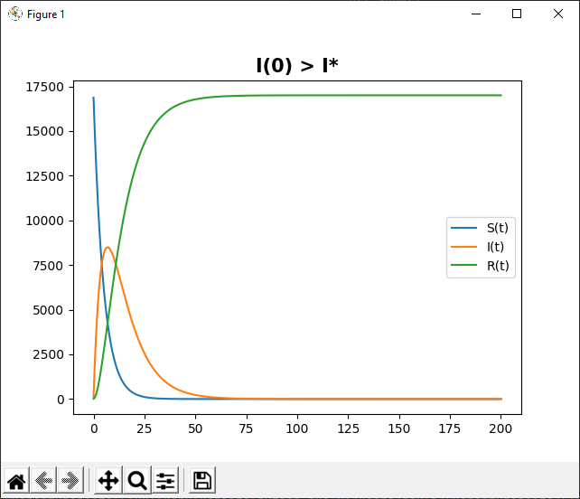

---
## Front matter
lang: ru-RU
title: Лабораторная работа 6. Модель SIR.
author:	Баулин Егор Александрович

## Formatting
toc: false
slide_level: 2
theme: metropolis
header-includes: 
 - \metroset{progressbar=frametitle,sectionpage=progressbar,numbering=fraction}
 - '\makeatletter'
 - '\beamer@ignorenonframefalse'
 - '\makeatother'
aspectratio: 43
section-titles: true
---

# Цель работы

Рассмотреть простейшую модель распространения болезней — модель SIR.

# Задачи
 
	- Построить графики изменения числа особей в каждой из трех групп по модели SIR.

	- Рассмотреть, как будет протекать эпидемия в разных случаях.

## Модель SIR

Предположим, что некая популяция, состоящая из N особей, (считаем, что популяция изолирована) подразделяется на три группы. 

- $S(t)$ — восприимчивые к болезни, но пока здоровые особи

- $I(t)$ — это число инфицированных особей, которые также при этом являются распространителями инфекции

- $R(t)$ — это здоровые особи с иммунитетом к болезни. 

До того, как число заболевших не превышает критического значения $I^*$ считаем, что все больные изолированы и не заражают здоровых. Когда $I(t)>I^*$, тогда инфицирование способны заражать восприимчивых к болезни особей.

## Уравнения

$$ \frac{\partial S}{\partial t} = \begin{cases} - \alpha S, если I(t)>I^* \\ 0, если I(t) \leq I^* \end{cases}$$

$$ \frac{\partial I}{\partial t} = \begin{cases} \alpha S - \beta I, если I(t)>I^* \\ - \beta I, если I(t) \leq I^* \end{cases}$$

$$ \frac{\partial R}{\partial t} = \beta I$$

# Результаты выполнения лабораторной работы

## Графики

{ #fig:001 width=70% }

## Графики 

{ #fig:002 width=70% }

# Выводы

 - Рассмотрел простейшую модель распространения заболеваний — модель SIR 

