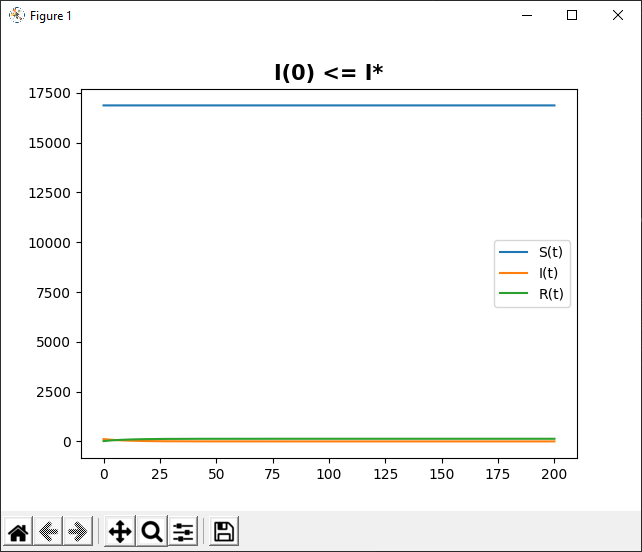
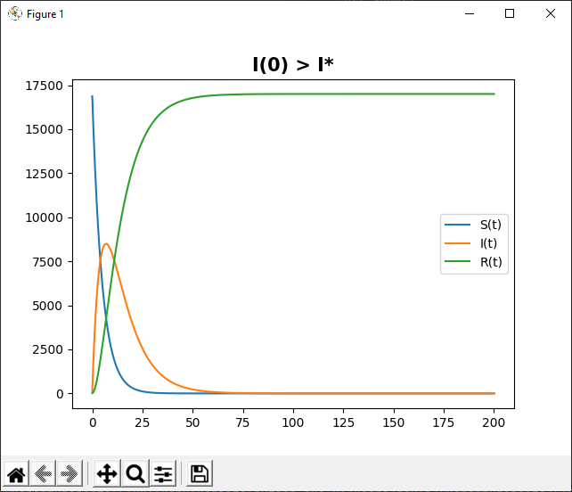

---
# Front matter
lang: ru-RU
title: "Лабораторная работа #6"
subtitle: "Задача об эпидемии. Вариант 11"
author: "Баулин Егор Александрович, учебная группа: НКНбд-01-18"

# Formatting
toc-title: "Содержание"
toc: true # Table of contents
toc_depth: 2
lof: true # List of figures
fontsize: 12pt
linestretch: 1.5
papersize: a4paper
documentclass: scrreprt
polyglossia-lang: russian
polyglossia-otherlangs: english
mainfont: PT Serif
romanfont: PT Serif
sansfont: PT Sans
monofont: PT Mono
mainfontoptions: Ligatures=TeX
romanfontoptions: Ligatures=TeX
sansfontoptions: Ligatures=TeX,Scale=MatchLowercase
monofontoptions: Scale=MatchLowercase
indent: true
pdf-engine: lualatex
header-includes:
  - \linepenalty=10 # the penalty added to the badness of each line within a paragraph (no associated penalty node) Increasing the value makes tex try to have fewer lines in the paragraph.
  - \interlinepenalty=0 # value of the penalty (node) added after each line of a paragraph.
  - \hyphenpenalty=50 # the penalty for line breaking at an automatically inserted hyphen
  - \exhyphenpenalty=50 # the penalty for line breaking at an explicit hyphen
  - \binoppenalty=700 # the penalty for breaking a line at a binary operator
  - \relpenalty=500 # the penalty for breaking a line at a relation
  - \clubpenalty=150 # extra penalty for breaking after first line of a paragraph
  - \widowpenalty=150 # extra penalty for breaking before last line of a paragraph
  - \displaywidowpenalty=50 # extra penalty for breaking before last line before a display math
  - \brokenpenalty=100 # extra penalty for page breaking after a hyphenated line
  - \predisplaypenalty=10000 # penalty for breaking before a display
  - \postdisplaypenalty=0 # penalty for breaking after a display
  - \floatingpenalty = 20000 # penalty for splitting an insertion (can only be split footnote in standard LaTeX)
  - \raggedbottom # or \flushbottom
  - \usepackage{float} # keep figures where there are in the text
  - \floatplacement{figure}{H} # keep figures where there are in the text
---

# Цель работы

	- Построить графики изменения числа особей в каждой из трех групп по модели.

	- Рассмотреть, как будет протекать эпидемия в разных случаях.


# Выполнение лабораторной работы

## Теоретическое введение

Предположим, что некая популяция, состоящая из N особей, (считаем, что популяция изолирована) подразделяется на три группы. 

- $S(t)$ — восприимчивые к болезни, но пока здоровые особи

- $I(t)$ — это число инфицированных особей, которые также при этом являются распространителями инфекции

- $R(t)$ — это здоровые особи с иммунитетом к болезни. 

До того, как число заболевших не превышает критического значения $I^*$ считаем, что все больные изолированы и не заражают здоровых. Когда $I(t)>I^*$, тогда инфицирование способны заражать восприимчивых к болезни особей.

Таким образом, скорость изменения числа S(t) меняется по следующему закону:

$$ \frac{\partial S}{\partial t} = \begin{cases} - \alpha S, если I(t)>I^* \\ 0, если I(t) \leq I^* \end{cases}$$

Поскольку каждая восприимчивая к болезни особь, которая, в конце концов, заболевает, сама становится инфекционной, то скорость изменения числа инфекционных особей представляет разность за единицу времени между заразившимися и теми, кто уже болеет и лечится, т.е.:

$$ \frac{\partial I}{\partial t} = \begin{cases} \alpha S - \beta I, если I(t)>I^* \\ - \beta I, если I(t) \leq I^* \end{cases}$$

А скорость изменения выздоравливающих особей (при этом приобретающие иммунитет к болезни)

$$ \frac{\partial R}{\partial t} = \beta I$$

Постоянные пропорциональности:

- $\alpha$ — коэффициент заболеваемости

- $\beta$ — коэффициент выздоровления

Для того, чтобы решения соответствующих уравнений определялось однозначно, необходимо задать начальные условия. Считаем, что на начало эпидемии в момент времени $t = 0$ нет особей с иммунитетом к болезни $R(0)=0$, а число инфицированных и восприимчивых к болезни особей $I(0)$ и $S(0)$ соответственно. Для анализа картины протекания эпидемии необходимо рассмотреть два случая: $I(0) \leq I^*$ и $I(0) > I^*$

Код на Python:

```

```

Динамика изменения числа людей в каждой из трех групп в случае, когда $I(0) \leq I^*$ с начальными условиями $I(0)=116, R(0)=16, S(0)=17000$.
Коэффициенты $\alpha = 0.2, \beta = 0.1$. (рис. 1)

{ #fig:001 width=70% }

Динамика изменения числа людей в каждой из трех групп в случае, когда $I(0) > I^*$ с начальными условиями $I(0)=116, R(0)=16, S(0)=17000$.
Коэффициенты $\alpha = 0.2, \beta = 0.1$. (рис. 2)

{ #fig:002 width=70% }


# Выводы

	- Построил графики изменения числа особей в каждой из трех групп по модели.

	- Рассмотрел, как будет протекать эпидемия в разных случаях.


