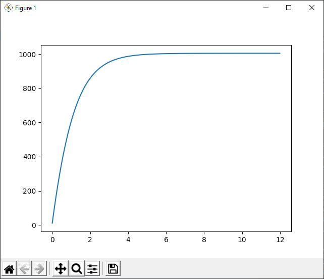
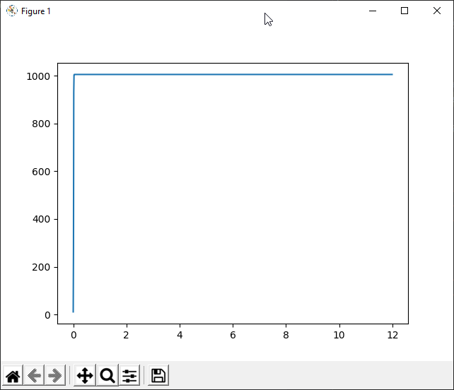
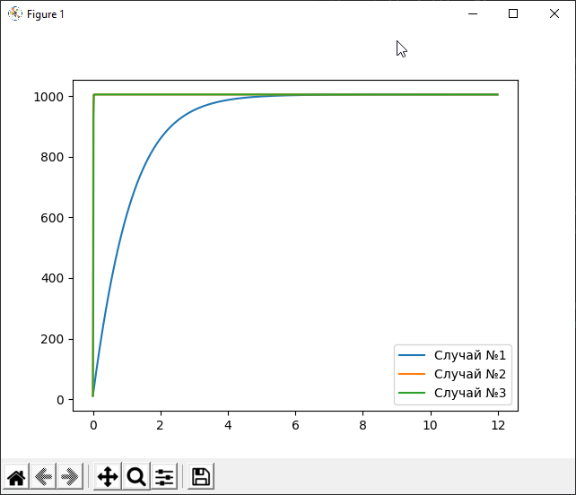
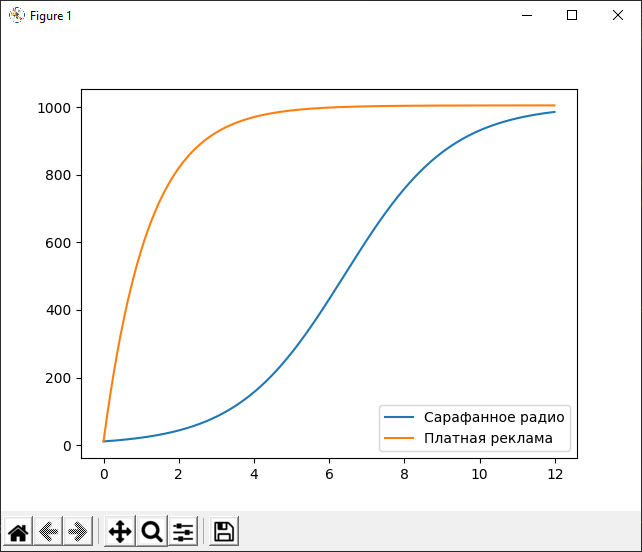

---
## Front matter
lang: ru-RU
title: Лабораторная работа 6. Модель SIR.
author:	Баулин Егор Александрович

## Formatting
toc: false
slide_level: 2
theme: metropolis
header-includes: 
 - \metroset{progressbar=frametitle,sectionpage=progressbar,numbering=fraction}
 - '\makeatletter'
 - '\beamer@ignorenonframefalse'
 - '\makeatother'
aspectratio: 43
section-titles: true
---

# Цель работы

Рассмотреть модель распространения рекламы.

# Задачи
 
	- Рассмотреть модель рапространения рекламы в разных случаях.

	- Построить график распространения рекламы.

	- Сравнить решения, учитывающее вклад только платной рекламы и учитывающее вклад только сарафанного радио.

## Модель распространения рекламы

Математическая модель распространения рекламы описывается уравнением:

$$ \frac{\partial n}{\partial t} = (\alpha_1(t) + \alpha_2(t)n(t))(N - n(t))$$

$\frac{\partial n}{\partial t}$ — скорость изменения со временем числа потребителей, узнавших о товаре и готовых его купить;

$t$ — время, прошедшее с начала рекламной кампании;

$n(t)$ — число уже информированных клиентов. 

$N$ — общее число потенциальных платежеспособных покупателей

$\alpha_1(t)>0$ — характеризует интенсивность рекламной кампании (зависит от затрат на рекламу в данный момент времени).

## Уравнения

- $\frac{\partial n}{\partial t} = (0.84 + 0.00022n(t))(N - n(t))$
- $\frac{\partial n}{\partial t} = (0.0000022 + 0.74n(t))(N - n(t))$
- $\frac{\partial n}{\partial t} = (0.74sin(t) + 0.35cos(t)n(t))(N - n(t))$

# Результаты выполнения лабораторной работы

## Графики
Первый случай: $\alpha_1(t) = 0.84$, $\alpha_2(t) = 0.00022$.

$\alpha_1(t) > \alpha_2(t)$. 

{ #fig:1 width=70% }

## Графики
Второй случай: $\alpha_1(t) = 0.000022$, $\alpha_2(t) = 0.74$. Наибольшая скорость достигается в момент времени.

$\alpha_1(t) < \alpha_2(t)$. 

{ #fig:2 width=70% }

## Графики
Третий случай: $\alpha_1(t) = 0.74*np.sin(t)$, $\alpha_2(t) = 0.35*np.sin(t)$. 

{ #fig:3 width=70% }

## Графики
Все случаи вместе:

{ #fig:4 width=70% }

## Графики
Для сравнения эффективности сарафанного радио и платной рекламы, предположим, что $\alpha_1( ) = \alpha_2(t) = 0.0007$. 

{ #fig:5 width=70% }

# Выводы

 - Рассмотрел модель распространения рекламы в разных случаях. 

